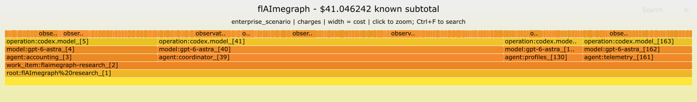

# Dollar-weighted flame graph demonstration



Download [cost.svg](cost.svg) and open it locally for the upstream FlameGraph zoom and search controls. GitHub's image preview is static. The source of the interaction code is the pinned, unmodified Brendan Gregg FlameGraph renderer; browser interactions were not exercised during this release verification.

This is the frozen, sanitized four-agent Codex research capture: 177 direct model observations, with a **$41.046242 known subtotal** under the declared enterprise scenario. It is not an invoice, a full-project total, or a Context Points calibration dataset. See [source provenance](../../examples/dogfood/README.md) and [the scenario rate card](../../examples/rates/enterprise-astra-scenario.json).

| Agent | Selected cost |
| --- | ---: |
| coordinator | $20.669904 |
| accounting | $9.110380 |
| telemetry | $6.530018 |
| profiles | $4.735940 |

Width represents exact nano-USD weights, displayed as decimal dollars in the title and tooltips. The horizontal position is not time. Attribution runs from the Work Item through agent, model and operation to each observation. Thin leaves become easier to inspect after zooming.

Reproduce every evidence and profile artifact from the repository root:

```sh
npm ci --ignore-scripts
npm run build
node dist/cli.js demo --out-dir .local/demo --png true
```

Node.js 22+, Perl and `rsvg-convert` are required for this command; omit `--png true` when only SVG is needed. All input is checked-in public fixture data. The command also writes normalized evidence, valuation, work-item records, folded stacks and gzip pprof, plus an OTLP projection. The [render manifest](render.json) records the profile identity, upstream renderer commit and SVG digest. The [geometry check](geometry-check.json) records the four agent widths and 177 positive observation leaves; its 0.101-pixel tolerance reflects upstream rounding of rectangle endpoints to 0.1 pixels.
