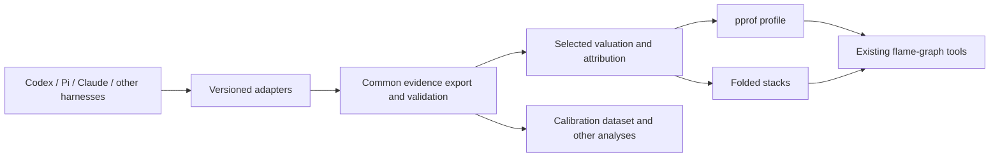

# A common export contract for agent cost profiles

User requirement, 6 September 2026: a standardized output format, or a standardized representation that can be converted to an existing flame-graph format, is a core deliverable. Supporting a handful of unrelated harness-specific parsers and pictures is insufficient.

This is the working design and acceptance contract for the next implementation step. It is not a claim of an adopted industry standard, a final wire schema, or completed cross-tool compatibility.

## Standardization intent

The user's subsequent clarification is to move toward a practical standard without making formal industry-standard status the prerequisite. The deliverable should therefore be an **open interoperability specification that can be implemented independently of flAImegraph**. This repository can host an experimental draft and reference adapters; the product must not be the only way to interpret the files.

Publish normative field meanings and invariants separately from implementation guidance. Use versioned releases, explicit extension rules, migration policy, conformance fixtures and machine-readable validation. Require independent producer/consumer compatibility evidence before claiming the contract is stable. Distinguish experimental, draft and stable status; publication alone does not establish adoption.

The preferred contribution is a narrow semantic profile and mappings over existing telemetry, financial and profiling formats. First compare the proposed bindings against OTel GenAI work, FOCUS, AgentMeasure and native harness conventions. Reuse an adequate existing specification; propose extensions upstream only for evidenced gaps. No external outreach, standards-body submission or claim of community endorsement is part of this research.

## Two compatible outputs



**Evidence interchange:** prefer established OTLP trace/log structures and versioned OTel GenAI mappings for execution and usage. Specify observation authority, identity, work linkage and financial correspondence where existing producers differ. Reuse FOCUS concepts for financial quantities, without relabeling arbitrary scenario estimates as billed or contracted cost. Preserve original source references and mapping versions. The normalization must be inspectable and validated before a profile is emitted. [Telemetry evidence](telemetry-coverage.md), [financial evidence](accounting-coverage.md).

**Profile interchange:** use pprof as the first rich profile target and folded stacks as the simple reference-renderer target. Pprof already defines sample paths, typed integer measures and labels; folded stacks already encode a path and weight. Publish the exact agent-cost interpretation of these structures. No new renderer format is needed. [Pinned pprof schema](https://github.com/google/pprof/blob/d6c3cb2f37ec22719bbaf5eb031d9a46635cb5b2/proto/profile.proto), [FlameGraph workflow](https://github.com/brendangregg/FlameGraph/blob/41fee1f99f9276008b7cd112fca19dc3ea84ac32/README.md).

The common evidence contract is richer than a flame graph: causal links, alternative work groupings, late corrections and missing observations cannot all fit in one weighted tree. The graph exports are reproducible projections. Standardization must cover meaning as well as file syntax; valid protobuf or JSON alone does not establish correct accounting.

## Minimum semantic contract

| Concern | Required agreement |
| --- | --- |
| Version and origin | Contract, source format and mapping versions; producer identity; stable observation references; capture interval |
| Quantity authority | Distinguish a new call/attempt observation from a repeated snapshot, aggregate, inherited history or correction; preserve conflicting evidence |
| Execution and work | Execution ancestry/links distinct from ticket/epic ownership and allocation; specify the chosen projection path |
| Usage | Explicit token categories and subset relationships; recorded zero distinct from unavailable; no cross-model equivalence implied |
| Monetary measure | One selected basis and currency per primary cost profile; effective rate scenario/contract, source and calculation version; original quantities retained |
| Numeric representation | Exact integer scale and boundary rounding; overflow checks; no silently lossy JSON-number conversion |
| Completeness | Included scope, excluded records, missing quantities/fees and reconciliation residuals; a subtotal must not be represented as a complete bill |
| Projection | Direct observation costs counted once; inclusive parent costs derived; shared allocation conserves the original value; selected grouping and losses documented |

Some bindings may require narrowly namespaced project attributes or a machine-readable manifest. Check existing and planned conventions before adding them, document each gap, and distinguish these local bindings from upstream-standard attributes. Do not use human-facing pprof comments as a machine extension protocol.

## First monetary profile binding

Start with one known monetary measure per profile to avoid inventing zero entries for unavailable quantities. A proposed binding is sample type `cost`, unit `nanoUSD`, meaning integer billionths of USD under one declared valuation. These strings are **producer-defined convention names**, not an existing pprof financial standard. Other currencies need separate documented bindings. A later multi-measure export must define availability rules explicitly.

Each pprof sample contains a selected attribution path, stored in pprof's leaf-first order, plus its direct cost. Stable identifiers and valuation references belong in documented labels; a machine-readable manifest describes profile-wide coverage, accounting basis and projection version. Frame identity must survive equal display names. Record the synthetic attribution meaning; this is not a sampled CPU stack.

The equivalent folded example, with illustrative values, is:

```text
Epic-1;Ticket-7;Agent-A;Response-42 125000000
Epic-1;Ticket-7;Agent-B;Response-43 75000000
```

Under the declared nano-USD binding these represent $0.125 and $0.075, totaling $0.20. The manifest supplies the meaning; the bare numbers do not. A real exporter must define frame escaping and stable identity so semicolons, whitespace or repeated names cannot corrupt attribution. Unknown amounts remain in coverage evidence and are not replaced with zero-cost samples. Signed adjustments require a defined net/gross/credit projection instead of ordinary negative rectangle widths.

## Acceptance evidence

- A published, versioned field binding and machine-checkable manifest/schema, with migration and compatibility rules.
- Sanitized examples from at least two harnesses mapped into the same contract, without harness-specific logic in the downstream profile converter.
- Independently specified fixtures covering duplicates, aggregates, retries, delegated work, shared ownership, missing usage, corrections and dated/scenario prices.
- Exact monetary conservation across work/agent/model regroupings, with declared losses and coverage preserved.
- A real pprof consumer and the existing FlameGraph renderer accept the corresponding exports. Round-trip or decoded-value checks verify identity and weights; rendered geometry is checked separately.
- The same evidence can support calibration records without reconstructing measurements from an SVG or losing the link to scope and outcome.

The existing prototypes demonstrate folded monetary rendering and scoped evidence reconciliation. They do not yet implement this common multi-harness contract or verify pprof interoperability. OTel Profiles remains a future target to evaluate against its schema maturity and actual consumers. [Detailed format assessment](profile-projection.md).
